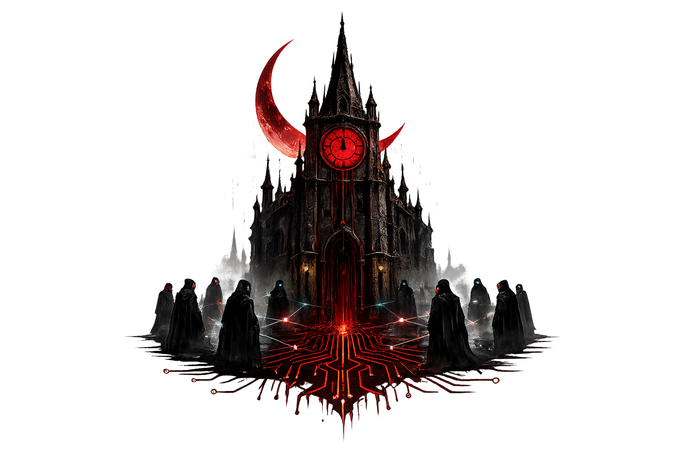
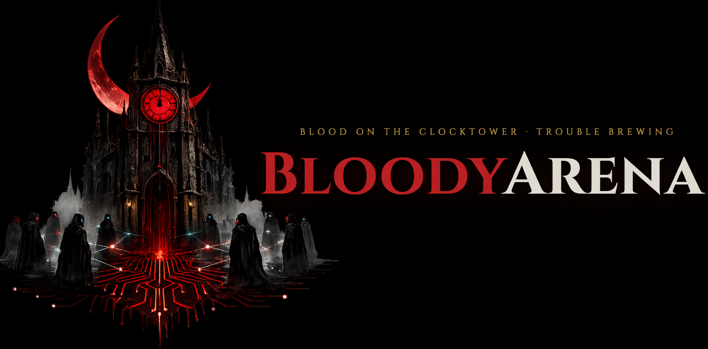
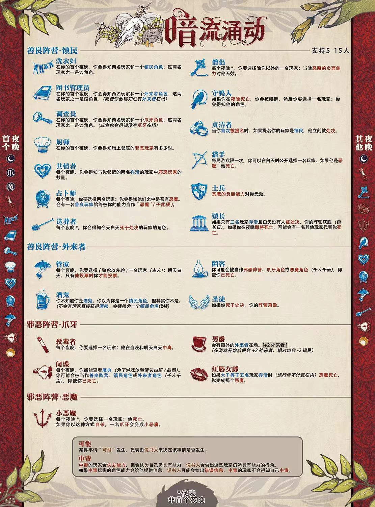

<h1> 血染钟楼 · 暗流涌动</h1>

<p align="center">
  
</p>

<p align="center">
  <a href="https://bloodarena.github.io/"></a>
  <a href="https://github.com/mjywf-creator/BloodyArena"></a>
  <a href="https://bloodarena.github.io/#rankings"></a>
</p>

> 一款基于 AI 的血染钟楼网页游戏与 AI 对战评测平台。你可以作为真人玩家与 AI 说书人和 AI 玩家一起体验经典社交推理剧本「暗流涌动」；也可以让 12 个不同的大模型全自动对战，生成排行榜来评测模型的社交推理能力。

---

## ✨ 功能特色

### 🕹️ 单人模式（index.html）

| | 功能 | 说明 |
|---|---|---|
| 🎭 | 完整的暗流涌动剧本 | 13 个镇民、4 个外来者、4 个爪牙、1 个恶魔，完整还原桌游体验 |
| 🤖 | 多模型 AI 玩家 | 支持 `DeepSeek`、`Gemini`、`Claude`、`GPT`、`MiMo`、`OpenRouter` 等，每个 AI 玩家可单独配置模型 |
| 🧠 | AI 说书人 | 说书人决策由大模型驱动，根据游戏局势智能生成信息和裁决，替代硬编码逻辑 |
| 😈 | 邪恶阵营密聊 | 首夜结束后、公聊前，恶魔与爪牙进行内部密聊，统一口径协调策略 |
| 📋 | 每日 AI 总结 | 每个白天结束时并行生成玩家总结，防止长局 `context` 超限，不阻塞游戏进程 |
| 🗣️ | AI 语音播报 (`TTS`) | 基于 `mimo-v2-tts` 引擎，15 种独特音色风格 |
| 🎵 | BGM 歌单系统 | 内置 15 首背景音乐，按氛围分类（开场、讨论、推理、入夜、决赛、结局） |
| 🎙️ | 语音输入 | 支持浏览器语音识别，用说话代替打字 |
| 💬 | 公聊 + 私聊 | 第一个白天可私聊交换线索，后续白天公开讨论 |
| 📊 | `Token` 用量追踪 | 实时显示各模型的 `Token` 消耗和费用估算 |
| 📝 | 导出复盘 | 支持导出游戏 `JSON` 和 `LLM` 轨迹，方便复盘分析 |
| 🎬 | 开场动画 | 游戏开始时播放引入视频，增强仪式感 |
| 💾 | 自动保存 | 游戏状态保存在浏览器 `localStorage`，刷新页面不会丢失进度 |

### 🏆 AI 对战评测系统（benchmark/）

> 📊 详细的模型评测结果与排行榜请查看 [leaderboard.html](leaderboard.html)，也可访问我们的[在线排行榜](https://bloodarena.github.io)。
> 📖 Benchmark 系统的详细使用说明请参阅 [benchmark/README.md](benchmark/README.md)

| | 功能 | 说明 |
|---|---|---|
| 🏆 | 全自动 AI 对战 | 12 个大模型各扮演一个玩家，自动完成完整游戏流程 |
| ⚖️ | 预设配板公平轮转 | 专业说书人设计的 5 组均衡配板，每组 12 局，确保每个模型恰好扮演每个角色一次 |
| 📈 | 排行榜系统 | 自动统计胜率并生成排行榜（`leaderboard.html`） |
| 🔍 | 数据浏览器 | 通过 `viewer.html` 回放和分析每局游戏详情 |
| 🔗 | 推理链记录 | 所有 `LLM` 调用启用 `reasoning`，思维链完整记录到轨迹文件 |
| 🔄 | 断点续跑 | 中断后重新运行相同命令即可继续 |


---

## 📋 环境准备 / 前置要求

1. **现代浏览器**（必需）
   - 建议使用 `Chrome` 或 `Edge`，不支持 `IE` 浏览器

2. **`Python 3`**（推荐，用于启动本地服务器）

3. **`Node.js` 18+**（Benchmark 评测需要）

4. **至少一个大模型 `API Key`**（必需）
   - 推荐选择以下之一：
     - **`DeepSeek`**（价格便宜，效果不错）：在 [platform.deepseek.com](https://platform.deepseek.com) 注册获取
     - **`OpenRouter`**（一个 Key 用多个模型）：在 [openrouter.ai](https://openrouter.ai) 注册获取
     - **`Gemini`** / **`Claude`** / **`GPT`**：分别从对应平台获取

---

## 🔧 安装步骤

### 第一步：下载项目

```bash
# 方法一：使用 git 克隆（推荐）
git clone https://github.com/mjywf-creator/The-Bloody
cd The-Bloody

# 方法二：直接下载 ZIP 压缩包，解压到任意文件夹
```

### 第二步：安装依赖（可选）

项目只有一个很小的依赖，不安装也不影响游戏运行：

```bash
npm install
```

> 💡 如果你没有安装 `Node.js` / `npm`，可以跳过这一步，不影响正常使用。

### 第三步：配置 `API Key`

这是最关键的一步！你需要编辑项目根目录下的 **`model_catalog.yaml`** 文件。

1. 用任意文本编辑器打开 `model_catalog.yaml`（推荐使用 `VS Code`，记事本也可以）
2. 找到最上面的 `api_keys` 部分：

```yaml
api_keys:
  mimo: "YOUR_MIMO_KEY"              # TTS 语音用的 key（可选）
  deepseek: "YOUR_DEEPSEEK_KEY"   # ← 把引号里的内容替换成你的 DeepSeek API Key
  gemini: "YOUR_GEMINI_KEY"            # Gemini API Key（可选）
  claude: "YOUR_CLAUDE_KEY"            # Claude API Key（可选）
  gpt: "YOUR_GPT_KEY"  # GPT API Key（可选）
  openrouter: "YOUR_OPENROUTER_KEY"        # OpenRouter API Key（可选）
```

3. **把你拥有的 `API Key` 填进对应的引号里**。例如，如果你有 `DeepSeek` 的 Key：

```yaml
api_keys:
  deepseek: "sk-xxxxxxxxxxxxxxxxxxxxxxxx"
```

4. 保存文件

> ⚠️ **注意**：你不需要填写所有的 Key，只要有一个就能玩！没有 Key 的服务商会显示为不可用。

### 第四步：配置模型提供商（高级，可选）

如果你使用的是自己部署的 API 中转服务，可以修改 `providers` 部分中对应服务商的 `base_url`：

```yaml
providers:
  gemini:
    label: "Gemini"
    base_url: "https://你的中转地址/v1"    # ← 修改为你的 API 地址
    api_key: "${gemini}"                    # 会自动引用上面 api_keys 中的 gemini
    protocol: "openai"                      # 协议类型：openai 或 claude
    models:
      - "gemini-3-pro-preview"
      - "gemini-3-flash-preview"
```

---

## 🚀 启动游戏

### 方法一：使用 `Python` 本地服务器（推荐）

```bash
# 在项目根目录下执行
python3 -m http.server 8000
```

然后在浏览器中打开：

| 页面 | 地址 | 说明 |
|------|------|------|
| **单人模式** | http://localhost:8000 | 人机对战主游戏 |
| **排行榜** | http://localhost:8000/leaderboard.html | AI 对战评测排行榜 |
| **数据浏览器** | http://localhost:8000/viewer.html | 游戏回放与详情分析 |

> 💡 使用本地服务器的好处是浏览器可以自动读取 `model_catalog.yaml` 配置文件。

### 方法二：直接双击打开 `HTML` 文件

直接用浏览器打开项目中的 `index.html` 文件。

> ⚠️ 这种方式下，浏览器可能无法自动读取 `model_catalog.yaml`。页面会提示你手动选择配置文件，点击 **「选择 `model_catalog.yaml`」** 按钮，找到项目目录中的 `model_catalog.yaml` 文件即可。

---

## 🖥️ 界面说明

<details>
<summary>🔝 <strong>顶部导航栏</strong><br>&nbsp;&nbsp;&nbsp;&nbsp;<sub>齿轮设置 · 阶段指示器 · 导出复盘 · 导出轨迹 · 重置</sub></summary>

| 元素 | 说明 |
|------|------|
| ⚙️ 齿轮按钮 | 打开左侧设置抽屉面板 |
| 标题区域 | 显示「血染钟楼 · 单人模式」和当前脚本名称 |
| 阶段指示器 | 显示当前游戏阶段（未开局 / 夜晚 / 白天 / 黄昏等） |
| 「导出复盘」按钮 | 将游戏记录导出为 `JSON` 文件 |
| 「导出轨迹」按钮 | 导出 `LLM` 调用轨迹（需先在设置中开启轨迹记录） |
| 「重置」按钮 | 重置整个游戏，清除所有数据 |

</details>

<details>
<summary>⚙️ <strong>左侧设置面板</strong>（点击齿轮打开）<br>&nbsp;&nbsp;&nbsp;&nbsp;<sub>游戏设置 · 模型配置 · 游戏控制 · TTS语音配置</sub></summary>

| 分区 | 选项 | 说明 |
|------|------|------|
| **游戏设置** | 人数 | 设置游戏人数（5-15 人） |
| | 你的名字 / 座位 / 角色 | 设定你的身份信息，角色可选「随机」 |
| | 生成玩家 → 随机发牌 → 开局 | 按顺序点击即可开始游戏 |
| | 随机模型 | 为每个 AI 玩家随机分配不同的模型 |
| **模型配置** | 默认模型 / 温度 | 选择模型，调节创造力（0-1） |
| | 白天讨论时长 | 1-30 分钟，默认 8 分钟 |
| | 模型健康检查 | 显示各模型配置是否正确、Key 是否有效 |
| **游戏控制** | 自动夜晚结算 | 开启后夜晚自动结算，无需手动点击 |
| | 记录 `LLM` 轨迹 | 记录所有 AI 调用详细信息（含 `system prompt`） |
| | 手动控制按钮 | 暂停 / 夜晚结算 / AI轮转 / 强制提名 / 投票结算 / 结束游戏 |
| **`TTS` 配置** | AI 语音播报 / 音量 | 开关语音播报，调节音量 |

</details>

<details>
<summary>🏠 <strong>主游戏区域</strong>（三栏布局）<br>&nbsp;&nbsp;&nbsp;&nbsp;<sub>城镇广场（座位圆环 · Token用量） · 聊天与操作（公聊 · 私聊 · @提及） · 个人信息（身份 · 夜晚行动）</sub></summary>

**左栏 — 城镇广场**

| 元素 | 说明 |
|------|------|
| 座位圆环 | 环形展示所有玩家座位、名字、存活状态；点击座位可标注猜测角色，点击 ➕ 可标注状态和标签 |
| 配置玩家模型 | 为每个 AI 玩家单独选择模型 |
| 配置摘要 | 显示当前角色分配情况 |
| `Token` 用量 | 各模型调用次数和费用统计 |

**中栏 — 聊天与操作**

| 元素 | 说明 |
|------|------|
| 公开聊天 | 所有玩家公开发言，支持按玩家筛选、关键词搜索 |
| 私聊 | 仅第一个白天可用，和指定玩家私聊交换线索 |
| 发言输入框 | 输入发言，支持 @ 提及、猎手格式按钮、语音输入 |
| 记录板 | 游戏重要事件记录（死亡、提名等） |

**右栏 — 个人信息**

| 元素 | 说明 |
|------|------|
| 你的身份 | 显示你被分配到的角色 |
| 你的私密信息 | 说书人给你的夜晚信息 |
| 你的夜晚行动 | 需要你操作的夜晚行动（如占卜师选人、僧侣保护等） |
| 当前任务 | 提示你现在应该做什么 |
| 事件记录 | 你个人的事件日志 |

</details>

<details>
<summary>🎵 <strong>底部 BGM 播放器</strong><br>&nbsp;&nbsp;&nbsp;&nbsp;<sub>歌单面板 · 播放控制 · 音量调节 · 角色板一览</sub></summary>

| 元素 | 说明 |
|------|------|
| ♪ 按钮 | 打开 BGM 歌单面板 |
| ▶ 按钮 | 播放/暂停当前音乐 |
| 曲目名称 | 显示当前播放的曲目 |
| 音量滑块 | 调节背景音乐音量 |
| 📜 板子按钮 | 查看暗流涌动角色板（所有角色一览图） |

</details>

---

## 🎮 游戏流程（完整教程）

<details>
<summary>🎲 <strong>一、开局准备</strong><br>&nbsp;&nbsp;&nbsp;&nbsp;<sub>设置人数、名字、座位、角色，选择 AI 模型，点击「生成玩家 → 随机发牌 → 开局」即可开始</sub></summary>

1. 打开游戏页面，点击 **「开始游戏」**（可跳过开场视频）
2. 点击左上角 ⚙️ 打开设置面板，设置基本信息：
   - **人数**：建议新手选 **7-8 人**（节奏快，容易上手）
   - **你的名字 / 座位 / 角色**：角色可选「随机」
3. 选择 **默认模型**（需已配置对应 `API Key`）
4. 按顺序点击：**「生成玩家」** → **「随机发牌」** → **「开局」**

> 💡 点击 **「随机模型」** 可让每个 AI 使用不同模型，对话风格更丰富！

</details>

<details>
<summary>🌙 <strong>二、第一个夜晚（首夜）</strong><br>&nbsp;&nbsp;&nbsp;&nbsp;<sub>说书人按顺序唤醒各角色执行能力，首夜恶魔不杀人。若你有夜晚行动，右侧面板会出现操作界面</sub></summary>

1. 开局后自动进入首夜，说书人按角色顺序依次唤醒执行能力：
   - 投毒者选人下毒 → 间谍查看魔典 → 信息类角色获得首夜信息 → 占卜师查验…
2. **如果你的角色有夜晚行动**，右侧「你的夜晚行动」区域会出现操作界面，按提示选择目标即可
3. **首夜恶魔不杀人**，第一个白天不会有人死亡
4. 开启「自动夜晚结算」则自动完成，否则需手动点击 **「夜晚结算」**

</details>

<details>
<summary>😈 <strong>三、邪恶阵营密聊</strong> <code>🆕</code><br>&nbsp;&nbsp;&nbsp;&nbsp;<sub>首夜结束后、公开讨论前，恶魔与爪牙进行一轮内部密聊，统一口径协调策略</sub></summary>

首夜结束后、第一个白天公开讨论之前，恶魔与爪牙进行一轮内部密聊：

- 每个邪恶玩家轮流发言，最多 3 条消息
- 善良阵营无法发言，界面显示「邪恶阵营密聊中…」
- 如果你是邪恶阵营，可与队友交流策略、互相暴露真实身份
- 密聊结束后自动进入正常白天讨论

> 💡 这个机制让邪恶阵营有机会在第一天讨论前统一口径，更贴近真实桌游体验。

</details>

<details>
<summary>☀️ <strong>四、白天讨论</strong><br>&nbsp;&nbsp;&nbsp;&nbsp;<sub>AI 玩家轮流发言，你可以输入发言或 @ 点名。第一个白天可私聊交换线索，讨论限时 8 分钟</sub></summary>

1. 天亮后说书人播报昨晚死亡信息，进入讨论阶段
2. AI 玩家按座位顺序轮流发言；轮到你时在输入框发言，或点击 **「跳过讨论」**
3. 可使用 **@ 功能** 点名某个玩家让他回应
4. **第一个白天特有 — 私聊**：切换到「私聊」标签，选择玩家私聊交换线索（⚠️ 仅第一个白天可用）
5. 讨论有时间限制（默认 8 分钟），结束后自动进入提名阶段
6. 每个白天结束时系统自动并行生成 AI 总结，压缩历史对话防止 `context` 超限

</details>

<details>
<summary>⚖️ <strong>五、提名与投票（黄昏）</strong><br>&nbsp;&nbsp;&nbsp;&nbsp;<sub>每人可提名一人，被提名者需辩解，全员投票决定是否处决。得票过半上处决台，票最高者被处决</sub></summary>

**提名阶段**：每个存活玩家可提名一人（含自己），每人仅一次机会，每人最多被提名一次

**投票阶段**：
1. 提名者陈述理由 → 被提名者辩解 → 所有人按顺序投票
2. 轮到你时：点击 **✓ 赞成** 或 **✗ 反对**（快捷键 **Y** / **N**）
3. 得票 ≥ 存活人数一半 → 上处决台；处决台上得票最多者被处决（票数相同则无人被处决）
4. 处决结算后进入下一个夜晚

</details>

<details>
<summary>🔁 <strong>六、后续夜晚</strong><br>&nbsp;&nbsp;&nbsp;&nbsp;<sub>小恶魔每晚杀一人，其他角色继续执行夜晚能力，天亮后说书人宣布死亡信息</sub></summary>

- 从第二夜开始，**小恶魔每晚选择一名玩家杀害**
- 有夜晚行动的角色继续执行能力（僧侣保护、占卜师查验等）
- 天亮后说书人宣布昨晚谁死了（不公布死者角色身份）

</details>

<details>
<summary>⚡ <strong>七、特殊情况</strong><br>&nbsp;&nbsp;&nbsp;&nbsp;<sub>猎手开枪、死亡玩家投票、贞洁者/圣徒/镇长的特殊触发条件</sub></summary>

| 情况 | 说明 |
|------|------|
| 🔫 猎手开枪 | 白天使用「猎手格式」按钮宣言射击，命中恶魔则其立即死亡，每局一次 |
| 💀 死亡玩家 | 死后仍可发言讨论，且有 **一次死人票**（整局仅一次） |
| 🛡️ 贞洁者被提名 | 若提名者是镇民，提名者被处决 |
| ⛪ 圣徒被处决 | 善良阵营立刻失败 |
| 🏛️ 镇长日 | 仅剩 3 人且白天无人处决 → 善良获胜 |
| 😈 邪恶自我暴露 | 邪恶阵营玩家之间允许互相暴露真实身份 |

</details>

<details>
<summary>🏁 <strong>八、游戏结束</strong><br>&nbsp;&nbsp;&nbsp;&nbsp;<sub>恶魔被处决或猎手击杀则善良胜；仅剩 2 人恶魔存活或圣徒被处决则邪恶胜。赛后可复盘聊天</sub></summary>

**胜利条件**

| 结果 | 条件 |
|------|------|
| ✅ 善良胜利 | 恶魔被处决，或猎手击杀恶魔 |
| ✅ 善良胜利 | 触发镇长日（仅剩 3 人且无人处决） |
| ❌ 邪恶胜利 | 场上仅剩 2 名存活玩家且恶魔仍存活 |
| ❌ 邪恶胜利 | 圣徒被处决 |

**赛后内容**
- 显示复盘面板：所有玩家真实角色、夜晚行为、聊天记录
- 可点击「生成复盘」让 AI 写游戏回顾，或「导出复盘」保存完整记录
- 进入赛后聊天模式：继续与 AI 玩家讨论对局，点击「AI轮转」让 AI 发表赛后感言

</details>

---

## 🎯 角色一览

<details>
<summary>😇 <strong>善良阵营</strong> — 镇民 13 个 + 外来者 4 个<br>&nbsp;&nbsp;&nbsp;&nbsp;<sub>👇 打开折叠，查看善良阵营详细介绍：洗衣妇 · 图书管理员 · 调查员 · 厨师 · 共情者 · 占卜师 · 送葬者 · 僧侣 · 守鸦人 · 贞洁者 · 猎手 · 士兵 · 镇长 · 管家 · 酒鬼 · 陌客 · 圣徒</sub></summary>

### 镇民（善良阵营）— 13 个

| 角色 | 能力简述 |
|------|----------|
| 洗衣妇 | 首夜得知两人中谁是某个镇民 |
| 图书管理员 | 首夜得知两人中谁是某个外来者（或没有外来者） |
| 调查员 | 首夜得知两人中谁是某个爪牙 |
| 厨师 | 首夜得知相邻邪恶玩家的对数（最多 3 对） |
| 共情者 | 每晚得知左右邻居中邪恶玩家的数量 |
| 占卜师 | 每晚选两人查验是否有恶魔（有一个善良干扰项） |
| 送葬者 | 每晚（非首夜）得知白天被处决者的角色 |
| 僧侣 | 每晚（非首夜）保护一人免受恶魔杀害 |
| 守鸦人 | 若夜晚死亡，可以查验一人的角色 |
| 贞洁者 | 首次被镇民提名时，提名者被处决 |
| 猎手 | 每局一次，白天宣言射击一人，若是恶魔则其死亡 |
| 士兵 | 免疫恶魔的杀害能力 |
| 镇长 | 仅剩 3 人时无处决则善良获胜；夜晚可能有人替死 |

### 外来者（善良阵营）— 4 个

| 角色 | 能力简述 |
|------|----------|
| 管家 | 每晚选一个"主人"，次日只能在主人投票时跟投 |
| 酒鬼 | 以为自己是某个镇民，但技能无效、信息可能错误 |
| 陌客 | 可能被识别为邪恶阵营或爪牙/恶魔角色 |
| 圣徒 | 若被处决，善良阵营立刻失败 |

</details>

<details>
<summary>😈 <strong>邪恶阵营</strong> — 爪牙 4 个 + 恶魔 1 个<br>&nbsp;&nbsp;&nbsp;&nbsp;<sub>👇 打开折叠，查看邪恶阵营详细介绍：投毒者 · 间谍 · 红唇女郎 · 男爵 · 小恶魔</sub></summary>

### 爪牙（邪恶阵营）— 4 个

| 角色 | 能力简述 |
|------|----------|
| 投毒者 | 每晚选一人中毒，其技能失效、信息可能错误 |
| 间谍 | 每晚查看魔典；可能被识别为善良阵营 |
| 红唇女郎 | 恶魔死亡时（≥5人存活），变为新恶魔 |
| 男爵 | 游戏中多出 2 名外来者（替换镇民） |

### 恶魔 — 1 个

| 角色 | 能力简述 |
|------|----------|
| 小恶魔 | 每晚杀一人；自杀时一名爪牙变为新恶魔 |

</details>

<details>
<summary>📊 <strong>玩家人数与角色分配</strong><br>&nbsp;&nbsp;&nbsp;&nbsp;<sub>5-15 人对应阵营配比表</sub></summary>

| 人数 | 镇民 | 外来者 | 爪牙 | 恶魔 |
|------|------|--------|------|------|
| 5 | 3 | 0 | 1 | 1 |
| 6 | 3 | 1 | 1 | 1 |
| 7 | 5 | 0 | 1 | 1 |
| 8 | 5 | 1 | 1 | 1 |
| 9 | 5 | 2 | 1 | 1 |
| 10 | 7 | 0 | 2 | 1 |
| 11 | 7 | 1 | 2 | 1 |
| 12 | 7 | 2 | 2 | 1 |
| 13 | 9 | 0 | 3 | 1 |
| 14 | 9 | 1 | 3 | 1 |
| 15 | 9 | 2 | 3 | 1 |

> 💡 如果有男爵在场，会额外增加 2 名外来者（替换 2 名镇民）。

</details>

血染钟楼·暗流涌动角色板子见：



---

## 🔧 高级功能

### AI 说书人（`LLM Storyteller`）

说书人的决策现已由大模型驱动，替代了原有的硬编码逻辑。AI 说书人会根据当前游戏局势智能地：

- 为信息类角色（洗衣妇、图书管理员、调查员等）生成合理的首夜/每夜信息
- 裁决特殊情况（如陌客被识别、猎手开枪判定等）
- 让游戏体验更接近有真人说书人主持的效果

### `TTS` 语音播报

开启 `TTS` 后，AI 玩家的发言会自动用语音朗读出来，每位 AI 拥有独特的音色风格（如"成熟男性 低沉磁性"、"少女 元气可爱"、"东北口音 豪爽大方"等共 15 种）。

**配置方法**：
1. 在 `model_catalog.yaml` 的 `api_keys` 中填写 `mimo` 的密钥
2. 在设置面板中开启 **「AI 语音播报」** 开关
3. 调节语音音量滑块

### 自定义模型

- **全局默认模型**：在设置面板的「默认模型」下拉菜单中选择
- **单独配置**：点击城镇广场下方的 **「配置玩家模型」** 按钮，可以为每个 AI 玩家选择不同的模型
- **随机分配**：点击 **「随机模型」** 按钮，自动为每个 AI 玩家随机分配模型
- **温度调节**：设置面板中的「温度」参数控制 AI 的随机性（0 = 最确定，1 = 最随机）
- **重复模型支持**：同一个模型可以被多个 AI 玩家同时使用

### `LLM` 轨迹记录

在设置面板中开启 **「记录 `LLM` 轨迹」** 后，所有 AI 的调用记录（包括 `system prompt`、输入、输出）都会被记录下来。可以通过顶部的 **「导出轨迹」** 按钮导出为文件，用于调试或研究。

### `Token` 用量追踪

游戏过程中会自动追踪每个模型的 `Token` 用量和费用。可以在城镇广场左侧的 **「`Token` 用量 & 花费」** 区域查看详细统计。

---

## 📁 项目结构

```
The-Bloody/
├── index.html                 # 主页面（单人模式游戏入口）
├── leaderboard.html           # AI 对战排行榜页面
├── viewer.html                # 游戏数据浏览器（回放与分析）
├── model_catalog.yaml         # 模型配置文件（需要填写 API Key）
├── package.json               # Node.js 依赖声明
├── begin_qwen.mp4             # 开场视频
├── progress.md                # 开发进度记录
│
├── js/                        # 单人模式 JavaScript 源码
│   ├── main.js                # 入口文件，初始化和事件绑定
│   ├── constants.js           # 角色数据、游戏规则、提示词模板
│   ├── state.js               # 游戏状态管理与持久化
│   ├── game-logic.js          # 核心游戏流程（开局、阶段切换、胜负判定）
│   ├── night-actions.js       # 夜晚行动结算逻辑
│   ├── discussion.js          # 白天讨论逻辑（AI轮转发言、邪恶密聊、每日总结）
│   ├── nomination.js          # 提名与投票逻辑
│   ├── private-chat.js        # 私聊系统
│   ├── api.js                 # API 调用、Token 统计
│   ├── model-catalog.js       # 模型目录解析与健康检查
│   ├── prompts.js             # AI 提示词构建
│   ├── tts.js                 # TTS 语音播报引擎
│   ├── bgm.js                 # 背景音乐播放器
│   ├── voice.js               # 语音输入（麦克风识别）
│   ├── chat.js                # 聊天消息渲染
│   ├── ui-helpers.js          # UI 渲染辅助函数
│   ├── overlays.js            # 弹窗、遮罩层
│   ├── settings.js            # 设置面板逻辑
│   ├── export.js              # 导出与复盘功能
│   └── utils.js               # 通用工具函数
│
├── benchmark/                 # AI 对战评测系统（详见 benchmark/README.md）
│   ├── config.js              # 配置：模型列表、配板、API 参数
│   ├── llm.js                 # LLM 调用封装（OpenRouter + MiMo 直连）
│   ├── schedule.js            # 角色分配调度器（预设配板轮转）
│   ├── engine.js              # 游戏引擎（核心逻辑 + 每日总结压缩）
│   ├── run.js                 # 主入口（模型探测 + 运行评测）
│   ├── stats.js               # 统计汇总（生成排行榜）
│   ├── gen-index.js           # 生成文件索引（供数据浏览器使用）
│   ├── role_boards.json       # 5 组预设配板
│   ├── role_assignment.txt    # 原始配板描述
│   └── README.md              # Benchmark 详细使用说明
│
├── css/                       # 样式文件
│   ├── variables.css          # CSS 变量（颜色、字体等）
│   ├── base.css               # 基础样式
│   ├── themes.css             # 主题（日/夜切换）
│   ├── layout.css             # 页面布局
│   ├── components.css         # 通用组件样式
│   ├── chat.css               # 聊天区域样式
│   ├── players.css            # 玩家卡片和座位圆环样式
│   ├── phases.css             # 阶段指示器样式
│   ├── sidebar.css            # 侧边栏样式
│   ├── bgm.css                # BGM 播放器样式
│   └── responsive.css         # 响应式适配
│
├── music/                     # 背景音乐文件（15 首 MP3）
└── pictures/                  # 图片资源
    └── trouble_brewing.jpg    # 暗流涌动角色板图片
```

---

## ❓ 常见问题 / FAQ

<details>
<summary><b>Q：打开页面后模型列表为空，怎么办？</b></summary>

**A**：这通常是因为浏览器无法读取 `model_catalog.yaml` 文件。请使用以下方法之一：
- **推荐**：使用 `python3 -m http.server 8000` 启动本地服务器，然后通过 `http://localhost:8000` 访问
- 页面上会出现 **「选择 model_catalog.yaml」** 按钮，点击后手动选择配置文件

</details>

<details>
<summary><b>Q：点击「开局」后报错了怎么办？</b></summary>

**A**：请检查以下几点：
1. 确保你在 `model_catalog.yaml` 中至少填写了一个有效的 `API Key`
2. 在设置面板中选择了一个可用的默认模型
3. 点击 **「重新检查模型配置」** 按钮，查看模型健康状态
4. 确保你的网络可以访问对应的 API 服务

</details>

<details>
<summary><b>Q：游戏进行中刷新了页面，数据会丢失吗？</b></summary>

**A**：不会！游戏状态会自动保存在浏览器的 `localStorage` 中。刷新页面后会自动恢复之前的进度。如果想重新开始，请点击顶部的 **「重置」** 按钮。

</details>

<details>
<summary><b>Q：如何换一个角色重新开始？</b></summary>

**A**：点击顶部的 **「重置」** 按钮清除当前游戏，然后在设置面板中重新设置人数、角色，重新走一遍「生成玩家 → 随机发牌 → 开局」的流程。

</details>

<details>
<summary><b>Q：TTS 语音没有声音怎么办？</b></summary>

**A**：请确认以下几点：
1. 在 `model_catalog.yaml` 中填写了 `mimo` 的 `API Key`
2. 设置面板中的「AI 语音播报」开关已打开
3. 语音音量滑块不是 0
4. 浏览器没有静音

</details>

<details>
<summary><b>Q：AI 发言很慢怎么办？</b></summary>

**A**：AI 发言速度取决于所使用模型的响应速度和网络状况。建议：
- 使用响应速度较快的模型（如 `DeepSeek Chat`、`Gemini Flash`）
- 确保网络连接稳定
- 可以适当减少游戏人数以减少 AI 调用次数

</details>

<details>
<summary><b>Q：费用大概是多少？</b></summary>

**A**：不同模型价格差异很大。游戏界面的「`Token` 用量 & 花费」区域会实时显示当前费用（以美元 USD 计算）。一般来说：
- **`DeepSeek Chat`**：一局约 $0.01-0.05（最便宜）
- **`Claude Haiku`**：一局约 $0.1-0.5
- **`Claude Sonnet`/`MiMo-V2-pro`**：一局约 $0.5-2
- **`Claude Opus`**：一局约 $5+（最贵）

💡 建议新手先用便宜的模型体验流程，熟悉后再尝试更高级的模型。

</details>

<details>
<summary><b>Q：支持手机玩吗？</b></summary>

**A**：页面有基本的响应式适配，但推荐在 **电脑浏览器** 上游玩以获得最佳体验。手机屏幕较小，操作可能不太方便。

</details>

<details>
<summary><b>Q：如何使用 AI 对战评测系统？</b></summary>

**A**：请参阅 [benchmark/README.md](benchmark/README.md) 获取详细的评测系统使用说明，包括环境配置、运行评测、查看排行榜等。

</details>

---

## ⚠️ 注意事项

1. **`API Key` 安全**：`API Key` 从 `model_catalog.yaml` 中读取，不会上传到任何服务器。游戏状态保存在浏览器 `localStorage` 中。请注意保管好你的配置文件，勿在公共电脑上使用
2. **费用控制**：AI 模型调用会产生费用，请关注 `Token` 用量面板的消耗情况。使用高价模型（如 `Claude Opus`）时费用会较高
3. **网络要求**：游戏需要网络连接来调用 AI `API`，请确保网络通畅
4. **浏览器兼容性**：推荐使用最新版 `Chrome` 或 `Edge`，语音输入功能需要浏览器支持 `Web Speech API`
5. **仅供个人使用**：本项目为个人学习和测试用途，请遵守各模型服务商的使用条款
6. **不要泄露配置文件**：`model_catalog.yaml` 中包含你的 `API Key`，请勿将其上传到公共仓库或分享给他人

---

## 📜 关于

本项目基于桌游《血染钟楼》(`Blood on the Clocktower`) 的规则，使用大语言模型 (`LLM`) 驱动 AI 说书人和 AI 玩家，实现了：

- **单人模式**：真人玩家与 AI 一起体验完整游戏流程
- **AI 对战评测**：12 个大模型全自动对战，评测模型的社交推理能力

脚本为「暗流涌动」(`Trouble Brewing`)，这是《血染钟楼》最经典的入门级剧本，适合新手学习游戏规则。

**技术栈**：
- 单人模式：纯前端实现（`HTML` + `CSS` + `JavaScript`），无需后端服务器，通过浏览器直接调用各大模型的 API
- 评测系统：`Node.js` 命令行工具，支持 `OpenRouter` 统一路由和 `MiMo` 直连

---

## 🔗 项目地址

**GitHub**: [https://github.com/mjywf-creator/BloodyArena](https://github.com/mjywf-creator/BloodyArena)

**项目网页**: [https://bloodarena.github.io/](https://bloodarena.github.io/)
